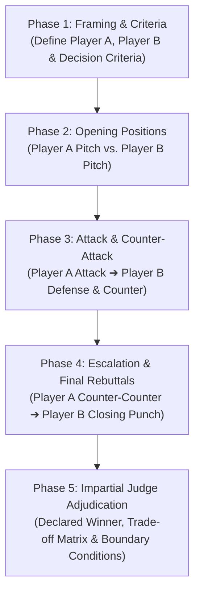

# Adversarial Debate (Binary Head-to-Head Deliberation)

Execute a structured, multi-round adversarial debate comparing exactly **two options** (Player A vs. Player B) against a clear set of decision criteria.

Instead of a shallow pros/cons list, this skill simulates a formal political debate with escalating rounds of argumentation: opening positions, direct attacks, defenses, counter-arguments, and final cross-rebuttals, adjudicated by an impartial judge.

---

## 5-Phase Debate Protocol



---

### Phase 1: Framing & Criteria Calibration
1. **Identify the Contenders**:
   - **Player A**: The first option, proposal, tool, or architecture.
   - **Player B**: The competing option, proposal, tool, or architecture.
2. **Establish the Evaluation Criteria**:
   - Explicit dimensions of comparison (e.g., Performance, Operational Overhead, Developer Ergonomics, Resilience, Migration Cost, Long-Term Maintenance).

---

### Phase 2: Opening Positions (Self-Advocacy)
Each player presents their strongest independent case without attacking the opponent yet.
- **Player A Opening**: Core strengths, primary benefits, and direct alignment with the criteria.
- **Player B Opening**: Core strengths, primary benefits, and direct alignment with the criteria.

---

### Phase 3: Cross-Examination & Direct Rebuttal
The debate turns adversarial. Players attack opponent vulnerabilities and defend their own.
- **Player A Direct Attack**: Why Player B is flawed, fragile, overengineered, or ill-suited for the criteria.
- **Player B Defense & Counter-Attack**: Refutes Player A's attack and strikes back at Player A's core weaknesses.

---

### Phase 4: Escalation & Closing Rebuttals
The final clash of arguments before the bench.
- **Player A Counter-Counter Argument**: Refutes Player B's defense and explains why Player A remains superior despite the counter-attack.
- **Player B Closing Punch**: Final rebuttal dismantling Player A's narrative and asserting why Player B is the only resilient path.

---

### Phase 5: Impartial Judge Adjudication
The impartial judge reviews the full debate record and delivers a definitive ruling.
- **Declared Winner**: Explicitly choose **Player A** or **Player B** (no ambiguous ties/draws).
- **Core Deciding Factor**: The pivotal argument or tradeoff that determined the outcome.
- **Decision Boundary (Exception Context)**: The specific conditions or edge cases under which the losing player would become the preferred choice.
- **Strategic Recommendation**: Clear, actionable guidance on executing the winning choice.

---

## Standard Output Format

```markdown
# ⚔️ Adversarial Debate: [Player A] vs [Player B]

**Evaluation Criteria**: [List of 2-4 core criteria]

---

## 🎙️ Round 1: Opening Positions

### 🔹 Player A ([Option A Name])
[Opening case: core strengths, value proposition, and criteria fulfillment]

### 🔸 Player B ([Option B Name])
[Opening case: core strengths, value proposition, and criteria fulfillment]

---

## 🥊 Round 2: Attacks & Counter-Arguments

### ⚔️ Player A Strikes:
[Direct attack on Player B's weak spots, risks, and hidden costs]

### 🛡️ Player B Defends & Counter-Attacks:
[Refutation of Player A's attack + direct assault on Player A's limitations]

---

## ⚡ Round 3: Escalation & Final Rebuttals

### 🔁 Player A Counter-Counter Argument:
[Refutation of Player B's counter and final case for superiority]

### 💥 Player B Closing Punch:
[Final rebuttal dismantling Player A's defense]

---

## ⚖️ Impartial Judge Adjudication

- 🏆 **Declared Winner**: **[Player A / Player B]**
- 🎯 **Deciding Rationale**: [The decisive argument that settled the debate]
- 🔄 **Decision Boundary**: [When would the losing option be preferred instead?]
- 📋 **Execution Directive**: [Concrete next steps for implementing the winning choice]
```
