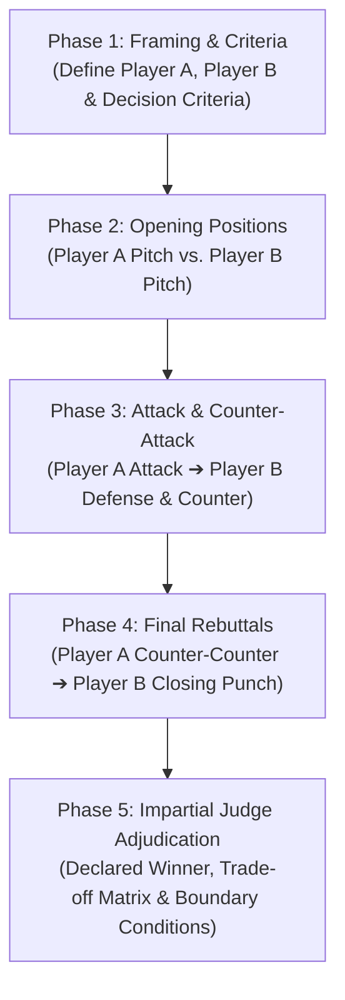

# Adversarial Debate (Binary Head-to-Head Deliberation)

Compare two options (Player A vs. Player B) against a clear set of decision criteria using a structured debate format.

Instead of a shallow pros-and-cons list, this skill runs structured rounds of argumentation: opening positions, direct attacks, defenses, counter-arguments, and final cross-rebuttals, ending with an impartial judge ruling.

---

## 5-Phase Debate Protocol



---

### Phase 1: Framing & Criteria Calibration
1. **Identify Contenders**:
   - **Player A**: First option, tool, proposal, or architecture.
   - **Player B**: Competing option, tool, proposal, or architecture.
2. **Establish Evaluation Criteria**:
   - Explicit dimensions of comparison (e.g., performance, operational overhead, developer ergonomics, resilience, migration cost, long-term maintenance).

---

### Phase 2: Opening Positions (Self-Advocacy)
Each player presents their strongest independent case without attacking the opponent yet.
- **Player A Opening**: Core strengths, primary benefits, and direct alignment with criteria.
- **Player B Opening**: Core strengths, primary benefits, and direct alignment with criteria.

---

### Phase 3: Cross-Examination & Direct Rebuttal
Players challenge opponent weaknesses and defend their own.
- **Player A Direct Attack**: Specific flaws, operational risks, or hidden costs in Player B.
- **Player B Defense & Counter-Attack**: Answers Player A's points and highlights Player A's core limitations.

---

### Phase 4: Final Rebuttals
- **Player A Counter-Counter Argument**: Answers Player B's counter and explains why Player A remains the better choice.
- **Player B Closing Punch**: Final rebuttal addressing Player A's defense.

---

### Phase 5: Impartial Judge Adjudication
The impartial judge reviews the debate record and gives a ruling.
- **Declared Winner**: Explicitly pick **Player A** or **Player B** (no ties or draws).
- **Core Deciding Factor**: The main tradeoff or argument that settled the debate.
- **Decision Boundary**: Specific conditions or constraints under which the losing option would be preferred instead.
- **Actionable Directive**: Practical next steps for adopting the winning choice.

---

## Output Format

```markdown
# Adversarial Debate: [Player A] vs [Player B]

**Evaluation Criteria**: [List of 2-4 core criteria]

---

## Round 1: Opening Positions

### Player A ([Option A Name])
[Opening case: core strengths, value proposition, and criteria fulfillment]

### Player B ([Option B Name])
[Opening case: core strengths, value proposition, and criteria fulfillment]

---

## Round 2: Attacks & Counter-Arguments

### Player A Strikes:
[Direct attack on Player B's weak spots, risks, and hidden costs]

### Player B Defends & Counter-Attacks:
[Refutation of Player A's attack + direct critique of Player A's limitations]

---

## Round 3: Final Rebuttals

### Player A Counter-Counter Argument:
[Refutation of Player B's counter and case for superiority]

### Player B Closing Punch:
[Final rebuttal addressing Player A's defense]

---

## Impartial Judge Adjudication

- **Declared Winner**: **[Player A / Player B]**
- **Deciding Rationale**: [The decisive argument that settled the debate]
- **Decision Boundary**: [When would the losing option be preferred instead?]
- **Execution Directive**: [Concrete next steps for implementing the winning choice]
```
