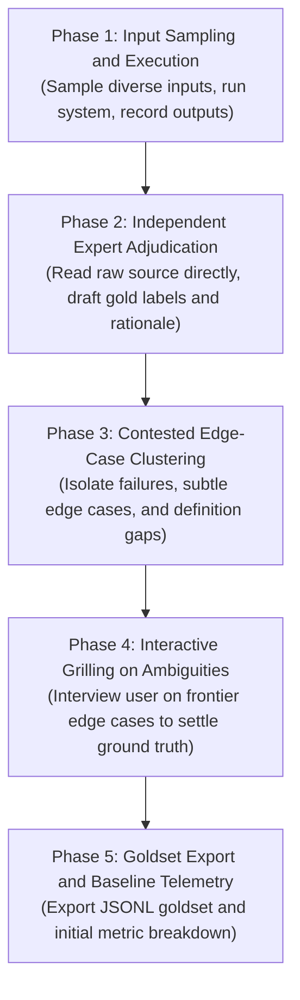

# Bootstrap Gold Dataset (Eval Dataset Creation and Edge-Case Grilling)

Build a ground-truth dataset from scratch when preparing to evaluate and tune LLM components, extractors, or classifiers with `tune-against-eval`.

This skill runs the system on sample inputs, evaluates raw source content directly without adopting the system's internal assumptions, drafts initial labels, and uses the grilling protocol to settle edge cases and ambiguous rules with the user.

---

## 5-Phase Bootstrapping Workflow



---

### Phase 1: Input Sampling and Execution

1. **Stratified Sampling**:
   - Collect 20 to 50 representative input items across distinct categories, difficulty tiers (nominal, noisy, complex, adversarial), and edge cases.
   - Do not sample only happy-path examples.
2. **Execute and Record**:
   - Run the current system or pipeline on each sampled input.
   - Capture the full output payload: `raw_input`, `system_output`, execution duration, and system metadata.

---

### Phase 2: Independent Expert Adjudication

Read the raw input text directly rather than trusting the system's intermediate output or reasoning:

1. **Draft Expected Output (`gold_label`)**:
   - What should the system have produced for this input?
2. **Adjudicate Correctness (`is_correct`)**:
   - `true`: System output matches the expected standard.
   - `false`: System output deviates in factual accuracy, extraction completeness, classification, or format.
3. **Categorize and Tag**:
   - Assign a domain `category_tag` (e.g., `invoice_total`, `negation_query`, `multilingual`).
   - Assign a `difficulty` rating (`easy`, `medium`, `hard`, `adversarial`).
   - Write a short `rationale` explaining the gold label.

---

### Phase 3: Contested Edge-Case Clustering

Isolate items in the ambiguity frontier:
- **System Failure Clashes**: Cases where system failure reveals an unstated business rule.
- **Subjective / Borderline Cases**: Inputs where reasonable people might choose different labels.
- **Context Deficits**: Inputs where domain knowledge or product policy dictates the answer.

Group these into a concise list of edge cases for grilling.

---

### Phase 4: Interactive Grilling on Ambiguities

Use the grilling protocol (`grilling` skill) to interview the user on unsettled edge cases.

Work through the questions in structured rounds:
- Present each ambiguous case with the raw input, system output, proposed gold label, and the core tradeoff.
- Always provide a recommended answer.
- Update item labels and record policy decisions based on the user's answers.

```markdown
**Q1: Edge Case #12 (Invoice Discount Negation)**:
- **Input**: "Total $100. Apply $20 voucher if signed before Friday (unsigned)."
- **System Output**: `$80`
- **Draft Gold Label**: `$100` (voucher condition unmet)
- **Policy Question**: Should conditional discounts in unsigned draft contracts be ignored or calculated conditionally?

**Recommended Answer**: Ignore conditional discounts on unsigned drafts; gold label should be `$100`.
```

---

### Phase 5: Goldset Export and Baseline Telemetry

After settling all ambiguities, export the dataset and report baseline metrics.

#### 1. Dataset Schema (`goldset.jsonl`)

Each line in the exported file uses this JSON schema:

```json
{
  "id": "eval_001",
  "input": "...",
  "system_output": "...",
  "gold_label": "...",
  "is_correct": false,
  "category_tag": "billing_address",
  "difficulty": "hard",
  "rationale": "System picked shipping address instead of billing address when nested inside secondary card.",
  "ambiguity_resolved": "User confirmed billing address takes precedence over shipping address in profile header."
}
```

#### 2. Baseline Summary
- **Total Samples**: $N$ items
- **Baseline Accuracy / Pass Rate**: Overall % correct
- **Error Breakdown by Category**: Precision, recall, F1, and error counts per `category_tag`
- **Dominant Failure Bucket**: Identifies the primary cluster of mistakes to target in `tune-against-eval`.

---

## Handoff

Once exported, hand off directly to `tune-against-eval`:
1. Save dataset to `evals/<component_name>_goldset.jsonl` (or project path).
2. Report baseline metrics and state the isolated failure bucket.
