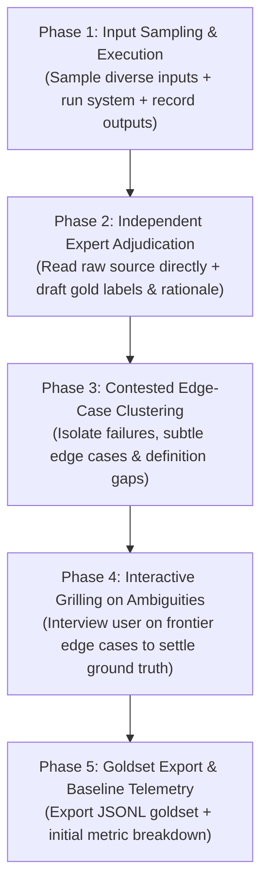

# Bootstrap Gold Dataset (Eval Dataset Creation & Edge-Case Grilling)

Bootstrap a verified, high-quality gold dataset (ground truth) from scratch when preparing to evaluate and tune LLM components, classifiers, extractors, or pipelines with `tune-against-eval`.

This skill bridges the gap from **zero data** to an **eval-ready gold set**: it executes the system across representative inputs, independently analyzes raw source content without relying on the system's own assumptions, drafts ground-truth adjudications, and invokes the **grilling protocol** to resolve edge cases and tricky boundary ambiguities with the user.

---

## 5-Phase Bootstrapping Workflow



---

### Phase 1: Input Sampling & Execution

1. **Stratified Sampling**:
   - Collect 20–50 representative input items across distinct categories, difficulty tiers (nominal, noisy, complex, adversarial), and edge cases.
   - Avoid sampling only happy-path examples.
2. **Execute & Record**:
   - Run the current system/pipeline on each sampled input.
   - Capture the complete output payload: `raw_input`, `system_output`, execution time, confidence/logprobs, and raw system metadata.

---

### Phase 2: Independent Expert Adjudication

Do not trust the system's internal reasoning or intermediate representations. Read the **raw input text/source** directly through an independent, critical human/expert lens:

1. **Draft the True Expected Output (`gold_label`)**:
   - What *should* the system have produced according to the true intent of the task?
2. **Adjudicate Correctness (`is_correct`)**:
   - `true`: System output strictly matches the gold standard.
   - `false`: System output deviates in factual accuracy, extraction completeness, classification, or formatting.
3. **Categorize & Tag**:
   - Assign a domain `category_tag` (e.g., `invoice_total`, `negation_query`, `multilingual`).
   - Assign a `difficulty` level (`easy`, `medium`, `hard`, `adversarial`).
   - Write a concise `rationale` explaining why the gold label is correct.

---

### Phase 3: Contested Edge-Case Clustering

Isolate and cluster all items that fall into the **Ambiguity Frontier**:
- **System Failure Clashes**: Cases where the system produced an unexpected answer that highlights an underspecified business rule.
- **Subjective / Borderline Cases**: Inputs where two reasonable humans might disagree on the correct label.
- **Context Deficits**: Inputs where external domain knowledge or product policy dictates the answer.

Group these into a curated list of **Tricky Cases for Grilling**.

---

### Phase 4: Interactive Grilling on Ambiguities

Invoke the **grilling protocol** (`grilling` skill) to interview the user on all unsettled edge cases.

Work through the questions in structured rounds:
- Present each ambiguous case with the raw input, system output, proposed gold label, and the underlying tradeoff/conflict.
- Always provide a clear **recommended answer (`➡️`)**.
- Update the item labels and formalize policy rules based on the user's answers.

```markdown
❓ **Q1** - **Edge Case #12 (Invoice Discount Negation)**:
- **Input**: "Total $100. Apply $20 voucher if signed before Friday (unsigned)."
- **System Output**: `$80`
- **Draft Gold Label**: `$100` (voucher condition unmet)
- **Policy Question**: Should conditional discounts in unsigned draft contracts be ignored or calculated conditionally?

➡️ **Recommended Answer**: Ignore conditional discounts on unsigned drafts; gold label should be `$100`.
```

---

### Phase 5: Goldset Export & Baseline Telemetry

Once all ambiguities are settled, generate the finalized dataset and output baseline performance metrics.

#### 1. Standard Dataset Schema (`goldset.jsonl`)

Each line in the exported file must follow this JSON schema:

```json
{
  "id": "eval_001",
  "input": "...",
  "system_output": "...",
  "gold_label": "...",
  "is_correct": false,
  "category_tag": "billing_address",
  "difficulty": "hard",
  "rationale": "System picked shipping address instead of billing address when nested inside secondary card.",
  "ambiguity_resolved": "User confirmed billing address takes precedence over shipping address in profile header."
}
```

#### 2. Baseline Telemetry Summary
- **Total Samples**: $N$ items
- **Baseline Accuracy / Pass Rate**: Overall % correct
- **Error Breakdown by Category**: Precision / Recall / F1 / Error count per `category_tag`
- **Dominant Failure Bucket**: Identifies the primary cluster of mistakes for subsequent optimization via `tune-against-eval`.

---

## Output Handoff

Once exported, the dataset is immediately compatible with the **`tune-against-eval`** skill:
1. Save dataset to `evals/<component_name>_goldset.jsonl` (or project-preferred path).
2. Report the baseline metrics and hand over to `tune-against-eval` with the dominant failure bucket isolated.
