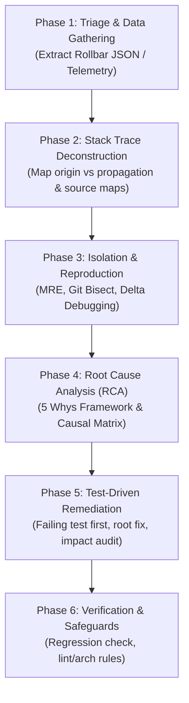

# Defensive Bug Remediation Lifecycle & Root Cause Fixer

This skill implements the **Defensive Engineering & Bug Remediation Lifecycle** (SPEC-ENG-BUG-0042). It provides a systematic, 6-phase engineering workflow for taking error traces (such as Rollbar JSON error dumps, stack traces, or telemetry reports) and achieving a verified, root-cause fix with regression testing and defensive safeguards.

## Core Engineering Principles & Axioms

> **The Fundamental Bug-Fix Axiom**
> - A defect is **not understood** until it can be deterministically reproduced in an isolated environment.
> - A bug is **not fixed** until a targeted test fails *before* the code change and passes *after* the code change without side effects.
> - **No superficial patches**: Never swallow exceptions, add blind null checks (`if (!x) return;`), or delete failing assertions without addressing the underlying state corruption or architectural flaw.

---

## 6-Phase Resolution Workflow

---

### Phase 1: Triage & Telemetry Data Gathering

When presented with an error trace (e.g. `tmp/rollbar/error.json` or raw log payload):

1. **Extract Information Matrix**:
   - **Environment Context**: Release version (`code_version`), environment (`production`/`staging`), feature flags, commit SHA.
   - **Runtime Metadata**: OS (`client.javascript.browser` or server OS), runtime/engine version, WASM/Node/Browser environment, permissions.
   - **Observability Artifacts**: Rollbar UUID, correlation/trace ID (`TraceID`), endpoint URL (`request.url`), IP, request payloads.
2. **Assign Severity**:
   - **SEV-1 (Critical)**: Core flow/service blocked, data corruption, security breach (SLA: immediate <15m).
   - **SEV-2 (High)**: Degraded functionality for key features/users, workaround is high friction (SLA: <4h).
   - **SEV-3 (Medium)**: Minor functionality issue or edge case (SLA: next sprint).
   - **SEV-4 (Low)**: Cosmetic, UI anomaly, minor logging noise (SLA: backlog).

*Detailed parsing guide for Rollbar payloads: [references/rollbar_parsing.md](./references/rollbar_parsing.md)*

---

### Phase 2: Stack Trace Deconstruction & Call Chain Analysis

Deconstruct the stack trace frame-by-frame:

1. **Distinguish Exception Origin vs. Propagation**:
   - The top frame (where exception was thrown) is often just where invalid state was *detected*, not where state was *corrupted*.
   - Trace back through the stack to identify state mutations and async boundaries.
2. **Symbolic Resolution & Source Maps**:
   - Map minified bundle offsets (`bundle.BxeeVxqy.js:75:20554`) or WASM functions (`epub_parser.js`, WASM offset) back to source files (`src/lib/...`, `lib/rbook/...`).
3. **Traverse Asynchronous & Worker Boundaries**:
   - Trace across `Promise` boundaries, microtask queues (`processMicrotasks`), Web Workers (`skin_install.worker.js`), and WASM instantiation limits (`WebAssembly.instantiateStreaming`).
4. **Telemetry Timeline Mapping**:
   - Reconstruct the sequential event log leading up to failure from `telemetry` array (network requests, DOM events, console warnings).

---

### Phase 3: Isolation & Deterministic Reproduction

Create a Minimal Reproducible Example (MRE) to isolate the bug from external dependencies:

1. **Isolation Techniques**:
   - **Git Bisect**: Binary search commit history using `git bisect start`, `git bisect bad`, `git bisect good <commit>`, and automated test execution.
   - **Delta Debugging**: Systematically strip down input data payloads (JSON blobs, files, parameters) to find the exact minimal payload causing crash.
   - **Dependency Mocking**: Mock network endpoints, OPFS storage, or third-party APIs using deterministic fake implementations.
   - **Concurrency Harness**: Spawn parallel workers/threads to force race conditions (TOCTOU).
2. **Construct Automated Reproduction Test**:
   - Write a standalone test script or unit/integration test that reliably triggers the failure.

---

### Phase 4: Root Cause Analysis (5 Whys Framework)

Apply the **5 Whys Methodology** to dig past surface symptoms down to systemic architectural flaws:

- **Why 1**: Why did the error throw? *(Immediate runtime failure statement)*
- **Why 2**: Why was the system state invalid at that point? *(Intermediate state breakdown)*
- **Why 3**: Why did the upstream process generate or allow that state? *(Upstream logic flaw)*
- **Why 4**: Why was that uncoordinated, unvalidated, or unconstrained? *(Process / synchronization gap)*
- **Why 5 (ROOT CAUSE)**: What is the underlying architectural, design, state management, or resource limitation flaw?

*For 5-Whys templates and RCA matrix examples: [references/5_whys_rca.md](./references/5_whys_rca.md)*

> **Anti-Pattern Warning**: If your proposed fix is `if (!obj) return;` or `try { ... } catch {}`, STOP. Ask: "Why was `obj` null/undefined?" and fix the upstream root cause.

---

### Phase 5: Test-Driven Remediation (TDR) & Side-Effect Audit

1. **Verify Test Failure (Before Fix)**:
   - Run the reproduction test written in Phase 3. Confirm it **FAILS** on un-fixed code.
2. **Implement Root Fix**:
   - Modify code to correct the fundamental root cause identified in Phase 4.
3. **Verify Test Success (After Fix)**:
   - Run the reproduction test. Confirm it **PASSES** clean.
4. **Behavioral Impact Matrix Audit**:
   - Audit concurrency safety, null safety, error recovery (transaction rollback), and latency/performance tradeoffs.

---

### Phase 6: Verification, Safeguards & Sign-Off

1. **Blast Radius Analysis**:
   - Check all callers and dependent modules to ensure zero breaking contract changes.
2. **Add Static Analysis & Architectural Guardrails**:
   - Add lint rules (ESLint, clippy/rustc), schema validations, or arch constraints to permanently ban the anti-pattern across the codebase.
3. **Execute SOP Sign-Off Checklist**:
   - [ ] **Telemetry Captured**: Stack trace, Rollbar JSON, env metadata cataloged.
   - [ ] **Deterministic Reproduction**: MRE/test created and fails on unfixed code.
   - [ ] **Root Cause Documented**: 5 Whys completed; underlying system flaw identified.
   - [ ] **Failing Test Written**: Test passes after fix with no regressions.
   - [ ] **Side-Effects Audited**: Latency, memory, state integrity verified.
   - [ ] **Defensive Guardrails Added**: Static analysis rule or validation guardrail active.

---

## Detailed References

- [Rollbar Payload Extraction Guide](./references/rollbar_parsing.md)
- [5 Whys Root Cause Analysis Reference](./references/5_whys_rca.md)
