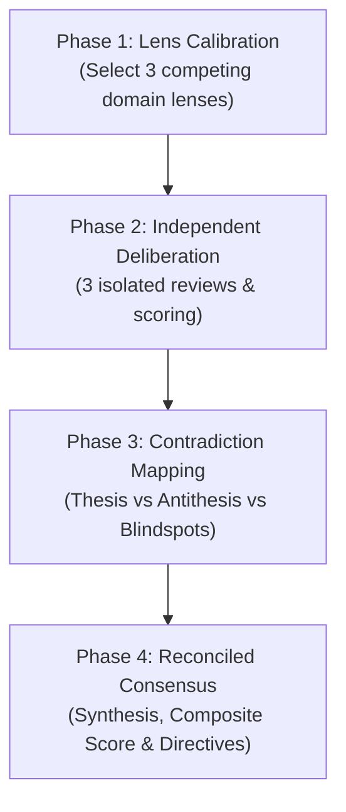

# Dialectic Consensus (Tri-Lens Multi-Perspective Deliberation)

Deliberate and evaluate complex proposals, technical architectures, design tradeoffs, content scoring, or strategic decisions by pitting three distinct, competing perspectives against each other to surface blind spots and forge a resilient, synthesized consensus.

Instead of a single-shot response that suffers from single-perspective bias, this skill orchestrates a dialectic process: thesis meets antithesis across three domain-calibrated lenses, contradictions are explicitly mapped, and a reconciled synthesis is produced.

---

## 4-Phase Deliberation Workflow



---

### Phase 1: Lens Selection & Stake Calibration

Instantiate three distinct evaluation lenses tailored to the domain. If specific lenses were not requested by the user, dynamically generate three perspectives with **built-in tension and competing stakes**:

- **Lens 1 (e.g., Velocity & Pragmatism / Optimist)**: Focuses on implementation speed, simplicity, developer ergonomics, business agility, and immediate utility.
- **Lens 2 (e.g., Defensive Reliability & Security / Skeptic)**: Focuses on failure modes, security posture, edge-case vulnerability, operational risk, and long-term maintenance burden.
- **Lens 3 (e.g., Architectural Purity & Scalability / Specialist)**: Focuses on domain correctness, structural elegance, system limits, invariant preservation, and future evolution.

*Rule: Every lens must have a distinct priority function. Never pick three lenses that optimize for the same outcome.*

---

### Phase 2: Independent Deliberation

Evaluate the subject through each lens completely in isolation. Do not allow early convergence or premature compromise.

For each of the three lenses, document:
1. **Lens Persona & Optimization Goal**: What this perspective champions.
2. **Strengths & Validated Merits**: Specific elements that succeed under this lens.
3. **Critical Deviations & Flaws**: Concrete risks, missed edge cases, or violations from this perspective.
4. **Lens Verdict & Score (0-100)**:
   - `0-20`: Unacceptable / Fatal flaws
   - `21-40`: Substandard / Heavy risk
   - `41-60`: Average / Needs major mitigation
   - `61-80`: Strong / Exceeds baseline
   - `81-100`: Exceptional / Complete alignment

---

### Phase 3: Contradiction & Tension Mapping

Compare the three independent deliberations and map the friction points:

| Dimension | Analysis |
|---|---|
| **Consensus Ground (High Confidence)** | Points where all 3 lenses agree unconditionally (highest signal truth). |
| **Direct Contradictions (Thesis vs Antithesis)** | Trade-offs where satisfying Lens A directly undermines Lens B (e.g., memory overhead vs lookup speed, strict validation vs DX). |
| **Specialist Blind Spots** | High-impact concerns discovered by only one lens that the others completely overlooked. |

---

### Phase 4: Synthesis & Reconciled Consensus

Synthesize the thesis, antithesis, and tensions into a single cohesive output.

1. **Composite Score & Verdict**:
   - Provide a final aggregated score (0–100) and explicit verdict (`Approved`, `Approved with Guardrails`, or `Rejected`).
   - The final score is a weighted synthesis that penalizes unaddressed critical risks from any single lens, rather than a naive arithmetic average.
2. **Synthesis Rationale**:
   - Explain how the core contradictions are reconciled or balanced.
   - Clarify what trade-offs are explicitly accepted and why.
3. **Actionable Directives & Guardrails**:
   - Concrete, numbered modifications required to satisfy the consensus and mitigate the identified risks.

---

## Standard Output Format

When executing this skill, output the deliberation using this structured format:

```markdown
# 🏛️ Dialectic Deliberation: [Title / Topic]

## 1. Jury Lenses
- **Lens A ([Name])**: [Core priority & stake]
- **Lens B ([Name])**: [Core priority & stake]
- **Lens C ([Name])**: [Core priority & stake]

---

## 2. Independent Deliberations

### 🔍 Lens A: [Name]
- **Score**: [Score / 100] | **Verdict**: [Verdict]
- **Strengths**: [Key points]
- **Risks & Concerns**: [Key points]

### 🔍 Lens B: [Name]
- **Score**: [Score / 100] | **Verdict**: [Verdict]
- **Strengths**: [Key points]
- **Risks & Concerns**: [Key points]

### 🔍 Lens C: [Name]
- **Score**: [Score / 100] | **Verdict**: [Verdict]
- **Strengths**: [Key points]
- **Risks & Concerns**: [Key points]

---

## 3. Contradiction & Tension Matrix
- **Shared Consensus**: [Where all lenses align]
- **Core Clashes**: [Direct tradeoffs between Lens X and Lens Y]
- **Isolated Blind Spots**: [Critical warnings from a single lens]

---

## 4. Reconciled Consensus & Actionable Directives
- **Final Consensus Score**: [Composite Score / 100]
- **Overall Verdict**: [Approved | Approved with Guardrails | Rejected]
- **Synthesis**: [How the tension is resolved]
- **Required Guardrails**:
  1. [Directive 1]
  2. [Directive 2]
```
