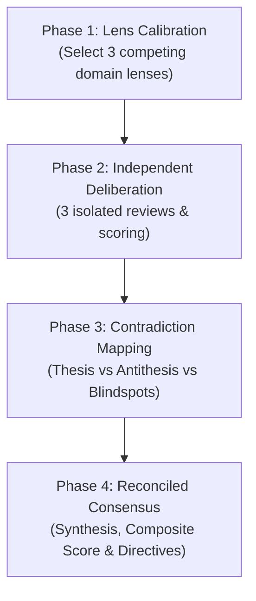

# Dialectic Consensus (Tri-Lens Multi-Perspective Deliberation)

Evaluate complex proposals, technical architectures, design tradeoffs, or scoring rubrics by comparing three competing perspectives to surface blind spots and build a practical consensus.

Instead of a single-shot response with single-perspective bias, this skill runs a structured evaluation: three domain lenses review the subject independently, contradictions are mapped directly, and a reconciled synthesis resolves the tension.

---

## 4-Phase Deliberation Workflow



---

### Phase 1: Lens Selection & Stake Calibration

Instantiate three distinct evaluation lenses for the domain. If specific lenses are not requested, generate three perspectives with opposing priorities:

- **Lens 1 (e.g., Velocity & Pragmatism)**: Focuses on implementation speed, simplicity, developer ergonomics, and immediate utility.
- **Lens 2 (e.g., Reliability & Security)**: Focuses on failure modes, security posture, edge-case vulnerability, operational risk, and maintenance costs.
- **Lens 3 (e.g., Architecture & Scalability)**: Focuses on domain correctness, structural elegance, system limits, invariant preservation, and future evolution.

*Rule: Every lens must have a distinct priority function. Do not pick lenses that optimize for the same outcome.*

---

### Phase 2: Independent Deliberation

Evaluate the subject through each lens in isolation without early compromise.

For each lens, document:
1. **Lens Persona & Optimization Goal**: What this perspective prioritizes.
2. **Strengths & Validated Merits**: Specific elements that succeed under this lens.
3. **Critical Deviations & Flaws**: Concrete risks, missed edge cases, or violations.
4. **Lens Verdict & Score (0-100)**:
   - `0-20`: Unacceptable / Fatal flaws
   - `21-40`: Substandard / Heavy risk
   - `41-60`: Average / Needs major mitigation
   - `61-80`: Strong / Exceeds baseline
   - `81-100`: Exceptional / Complete alignment

---

### Phase 3: Contradiction & Tension Mapping

Compare the three deliberations and map the friction points:

| Dimension | Analysis |
|---|---|
| **Consensus Ground** | Points where all 3 lenses agree unconditionally (highest confidence signal). |
| **Direct Contradictions** | Trade-offs where satisfying Lens A directly undermines Lens B (e.g., memory overhead vs lookup speed, strict validation vs DX). |
| **Specialist Blind Spots** | High-impact concerns discovered by only one lens that the others missed. |

---

### Phase 4: Synthesis & Reconciled Consensus

Synthesize the findings into a clear decision.

1. **Composite Score & Verdict**:
   - Provide a final aggregated score (0–100) and explicit verdict (`Approved`, `Approved with Guardrails`, or `Rejected`).
   - The final score is a weighted synthesis that penalizes unaddressed critical risks from any single lens, rather than a naive arithmetic average.
2. **Synthesis Rationale**:
   - Explain how the core contradictions are balanced.
   - Clarify which trade-offs are accepted and why.
3. **Actionable Directives & Guardrails**:
   - Concrete, numbered modifications required to satisfy the consensus and mitigate risks.

---

## Output Format

```markdown
# Dialectic Deliberation: [Title / Topic]

## 1. Jury Lenses
- **Lens A ([Name])**: [Core priority & stake]
- **Lens B ([Name])**: [Core priority & stake]
- **Lens C ([Name])**: [Core priority & stake]

---

## 2. Independent Deliberations

### Lens A: [Name]
- **Score**: [Score / 100] | **Verdict**: [Verdict]
- **Strengths**: [Key points]
- **Risks & Concerns**: [Key points]

### Lens B: [Name]
- **Score**: [Score / 100] | **Verdict**: [Verdict]
- **Strengths**: [Key points]
- **Risks & Concerns**: [Key points]

### Lens C: [Name]
- **Score**: [Score / 100] | **Verdict**: [Verdict]
- **Strengths**: [Key points]
- **Risks & Concerns**: [Key points]

---

## 3. Contradiction & Tension Matrix
- **Shared Consensus**: [Where all lenses align]
- **Core Clashes**: [Direct tradeoffs between Lens X and Lens Y]
- **Isolated Blind Spots**: [Critical warnings from a single lens]

---

## 4. Reconciled Consensus & Directives
- **Final Consensus Score**: [Composite Score / 100]
- **Overall Verdict**: [Approved | Approved with Guardrails | Rejected]
- **Synthesis**: [How the tension is resolved]
- **Required Guardrails**:
  1. [Directive 1]
  2. [Directive 2]
```
